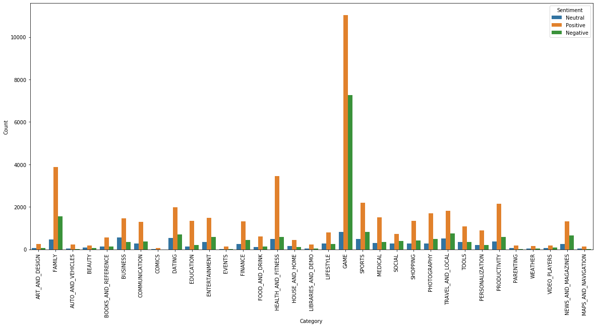
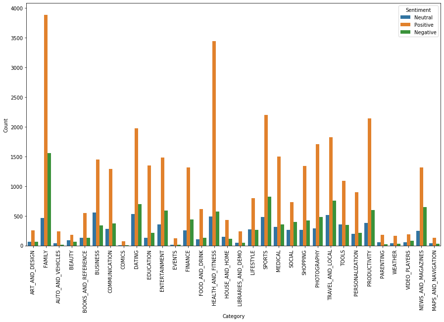
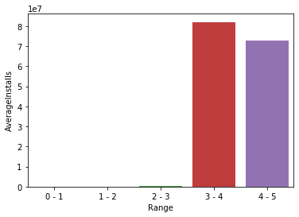
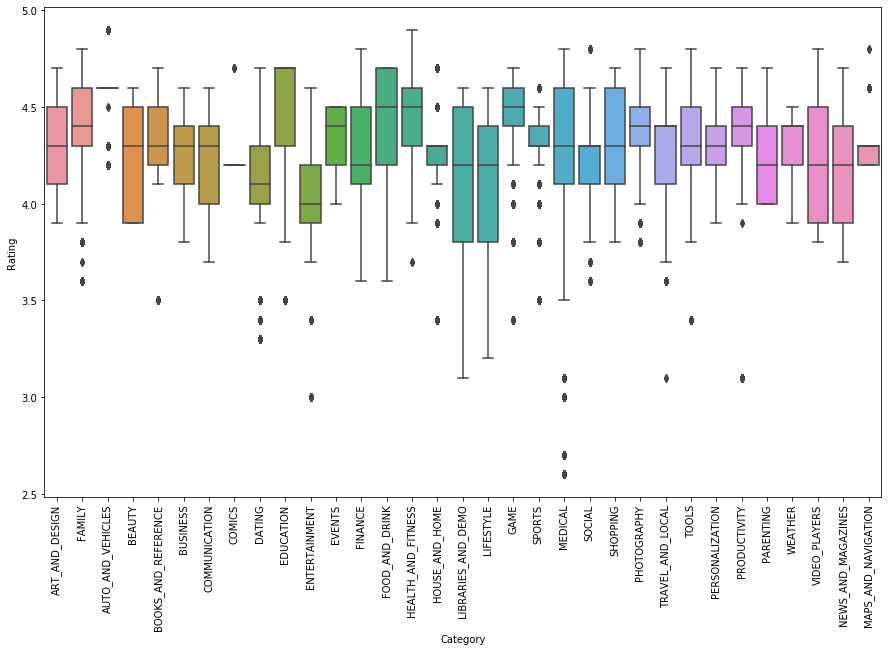
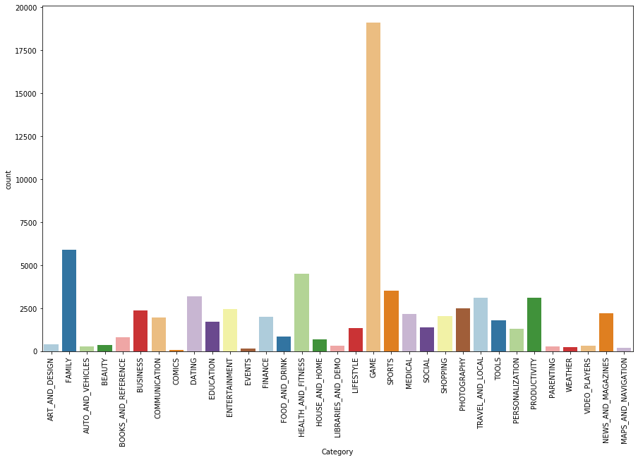
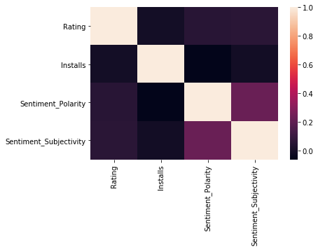
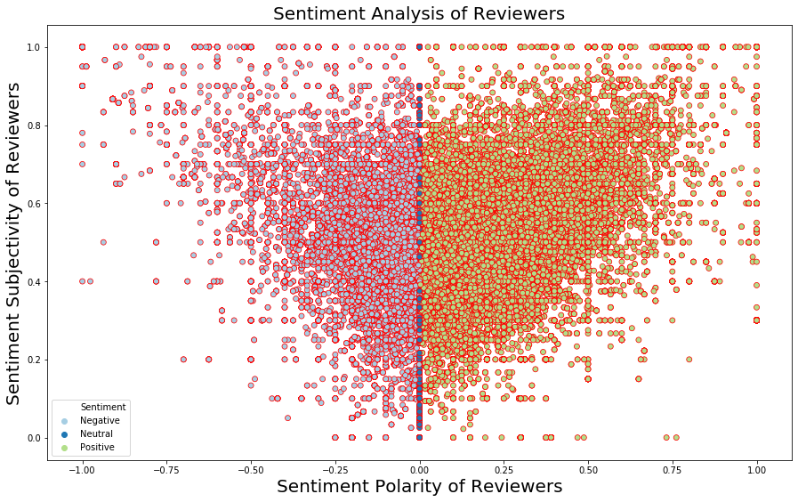

```python
import numpy as np
import pandas as pd
import seaborn as sns

```


```python
data = pd.read_csv('/Users/sahithireddypaspuleti/Datasciencerepository/data/external/googleplaystore.csv')
data
```


<div>

<table border="1" class="dataframe">
  <thead>
    <tr style="text-align: right;">
      <th></th>
      <th>App</th>
      <th>Category</th>
      <th>Rating</th>
      <th>Reviews</th>
      <th>Size</th>
      <th>Installs</th>
      <th>Type</th>
      <th>Price</th>
      <th>Content Rating</th>
      <th>Genres</th>
      <th>Last Updated</th>
      <th>Current Ver</th>
      <th>Android Ver</th>
    </tr>
  </thead>
  <tbody>
    <tr>
      <th>0</th>
      <td>Photo Editor &amp; Candy Camera &amp; Grid &amp; ScrapBook</td>
      <td>ART_AND_DESIGN</td>
      <td>4.1</td>
      <td>159</td>
      <td>19M</td>
      <td>10,000+</td>
      <td>Free</td>
      <td>0</td>
      <td>Everyone</td>
      <td>Art &amp; Design</td>
      <td>January 7, 2018</td>
      <td>1.0.0</td>
      <td>4.0.3 and up</td>
    </tr>
    <tr>
      <th>1</th>
      <td>Coloring book moana</td>
      <td>ART_AND_DESIGN</td>
      <td>3.9</td>
      <td>967</td>
      <td>14M</td>
      <td>500,000+</td>
      <td>Free</td>
      <td>0</td>
      <td>Everyone</td>
      <td>Art &amp; Design;Pretend Play</td>
      <td>January 15, 2018</td>
      <td>2.0.0</td>
      <td>4.0.3 and up</td>
    </tr>
    <tr>
      <th>2</th>
      <td>U Launcher Lite – FREE Live Cool Themes, Hide ...</td>
      <td>ART_AND_DESIGN</td>
      <td>4.7</td>
      <td>87510</td>
      <td>8.7M</td>
      <td>5,000,000+</td>
      <td>Free</td>
      <td>0</td>
      <td>Everyone</td>
      <td>Art &amp; Design</td>
      <td>August 1, 2018</td>
      <td>1.2.4</td>
      <td>4.0.3 and up</td>
    </tr>
    <tr>
      <th>3</th>
      <td>Sketch - Draw &amp; Paint</td>
      <td>ART_AND_DESIGN</td>
      <td>4.5</td>
      <td>215644</td>
      <td>25M</td>
      <td>50,000,000+</td>
      <td>Free</td>
      <td>0</td>
      <td>Teen</td>
      <td>Art &amp; Design</td>
      <td>June 8, 2018</td>
      <td>Varies with device</td>
      <td>4.2 and up</td>
    </tr>
    <tr>
      <th>4</th>
      <td>Pixel Draw - Number Art Coloring Book</td>
      <td>ART_AND_DESIGN</td>
      <td>4.3</td>
      <td>967</td>
      <td>2.8M</td>
      <td>100,000+</td>
      <td>Free</td>
      <td>0</td>
      <td>Everyone</td>
      <td>Art &amp; Design;Creativity</td>
      <td>June 20, 2018</td>
      <td>1.1</td>
      <td>4.4 and up</td>
    </tr>
    <tr>
      <th>5</th>
      <td>Paper flowers instructions</td>
      <td>ART_AND_DESIGN</td>
      <td>4.4</td>
      <td>167</td>
      <td>5.6M</td>
      <td>50,000+</td>
      <td>Free</td>
      <td>0</td>
      <td>Everyone</td>
      <td>Art &amp; Design</td>
      <td>March 26, 2017</td>
      <td>1.0</td>
      <td>2.3 and up</td>
    </tr>
    <tr>
      <th>6</th>
      <td>Smoke Effect Photo Maker - Smoke Editor</td>
      <td>ART_AND_DESIGN</td>
      <td>3.8</td>
      <td>178</td>
      <td>19M</td>
      <td>50,000+</td>
      <td>Free</td>
      <td>0</td>
      <td>Everyone</td>
      <td>Art &amp; Design</td>
      <td>April 26, 2018</td>
      <td>1.1</td>
      <td>4.0.3 and up</td>
    </tr>
    <tr>
      <th>7</th>
      <td>Infinite Painter</td>
      <td>ART_AND_DESIGN</td>
      <td>4.1</td>
      <td>36815</td>
      <td>29M</td>
      <td>1,000,000+</td>
      <td>Free</td>
      <td>0</td>
      <td>Everyone</td>
      <td>Art &amp; Design</td>
      <td>June 14, 2018</td>
      <td>6.1.61.1</td>
      <td>4.2 and up</td>
    </tr>
    <tr>
      <th>8</th>
      <td>Garden Coloring Book</td>
      <td>ART_AND_DESIGN</td>
      <td>4.4</td>
      <td>13791</td>
      <td>33M</td>
      <td>1,000,000+</td>
      <td>Free</td>
      <td>0</td>
      <td>Everyone</td>
      <td>Art &amp; Design</td>
      <td>September 20, 2017</td>
      <td>2.9.2</td>
      <td>3.0 and up</td>
    </tr>
    <tr>
      <th>9</th>
      <td>Kids Paint Free - Drawing Fun</td>
      <td>ART_AND_DESIGN</td>
      <td>4.7</td>
      <td>121</td>
      <td>3.1M</td>
      <td>10,000+</td>
      <td>Free</td>
      <td>0</td>
      <td>Everyone</td>
      <td>Art &amp; Design;Creativity</td>
      <td>July 3, 2018</td>
      <td>2.8</td>
      <td>4.0.3 and up</td>
    </tr>
    <tr>
      <th>10</th>
      <td>Text on Photo - Fonteee</td>
      <td>ART_AND_DESIGN</td>
      <td>4.4</td>
      <td>13880</td>
      <td>28M</td>
      <td>1,000,000+</td>
      <td>Free</td>
      <td>0</td>
      <td>Everyone</td>
      <td>Art &amp; Design</td>
      <td>October 27, 2017</td>
      <td>1.0.4</td>
      <td>4.1 and up</td>
    </tr>
    <tr>
      <th>11</th>
      <td>Name Art Photo Editor - Focus n Filters</td>
      <td>ART_AND_DESIGN</td>
      <td>4.4</td>
      <td>8788</td>
      <td>12M</td>
      <td>1,000,000+</td>
      <td>Free</td>
      <td>0</td>
      <td>Everyone</td>
      <td>Art &amp; Design</td>
      <td>July 31, 2018</td>
      <td>1.0.15</td>
      <td>4.0 and up</td>
    </tr>
    <tr>
      <th>12</th>
      <td>Tattoo Name On My Photo Editor</td>
      <td>ART_AND_DESIGN</td>
      <td>4.2</td>
      <td>44829</td>
      <td>20M</td>
      <td>10,000,000+</td>
      <td>Free</td>
      <td>0</td>
      <td>Teen</td>
      <td>Art &amp; Design</td>
      <td>April 2, 2018</td>
      <td>3.8</td>
      <td>4.1 and up</td>
    </tr>
    <tr>
      <th>13</th>
      <td>Mandala Coloring Book</td>
      <td>ART_AND_DESIGN</td>
      <td>4.6</td>
      <td>4326</td>
      <td>21M</td>
      <td>100,000+</td>
      <td>Free</td>
      <td>0</td>
      <td>Everyone</td>
      <td>Art &amp; Design</td>
      <td>June 26, 2018</td>
      <td>1.0.4</td>
      <td>4.4 and up</td>
    </tr>
    <tr>
      <th>14</th>
      <td>3D Color Pixel by Number - Sandbox Art Coloring</td>
      <td>ART_AND_DESIGN</td>
      <td>4.4</td>
      <td>1518</td>
      <td>37M</td>
      <td>100,000+</td>
      <td>Free</td>
      <td>0</td>
      <td>Everyone</td>
      <td>Art &amp; Design</td>
      <td>August 3, 2018</td>
      <td>1.2.3</td>
      <td>2.3 and up</td>
    </tr>
    <tr>
      <th>15</th>
      <td>Learn To Draw Kawaii Characters</td>
      <td>ART_AND_DESIGN</td>
      <td>3.2</td>
      <td>55</td>
      <td>2.7M</td>
      <td>5,000+</td>
      <td>Free</td>
      <td>0</td>
      <td>Everyone</td>
      <td>Art &amp; Design</td>
      <td>June 6, 2018</td>
      <td>NaN</td>
      <td>4.2 and up</td>
    </tr>
    <tr>
      <th>16</th>
      <td>Photo Designer - Write your name with shapes</td>
      <td>ART_AND_DESIGN</td>
      <td>4.7</td>
      <td>3632</td>
      <td>5.5M</td>
      <td>500,000+</td>
      <td>Free</td>
      <td>0</td>
      <td>Everyone</td>
      <td>Art &amp; Design</td>
      <td>July 31, 2018</td>
      <td>3.1</td>
      <td>4.1 and up</td>
    </tr>
    <tr>
      <th>17</th>
      <td>350 Diy Room Decor Ideas</td>
      <td>ART_AND_DESIGN</td>
      <td>4.5</td>
      <td>27</td>
      <td>17M</td>
      <td>10,000+</td>
      <td>Free</td>
      <td>0</td>
      <td>Everyone</td>
      <td>Art &amp; Design</td>
      <td>November 7, 2017</td>
      <td>1.0</td>
      <td>2.3 and up</td>
    </tr>
    <tr>
      <th>18</th>
      <td>FlipaClip - Cartoon animation</td>
      <td>ART_AND_DESIGN</td>
      <td>4.3</td>
      <td>194216</td>
      <td>39M</td>
      <td>5,000,000+</td>
      <td>Free</td>
      <td>0</td>
      <td>Everyone</td>
      <td>Art &amp; Design</td>
      <td>August 3, 2018</td>
      <td>2.2.5</td>
      <td>4.0.3 and up</td>
    </tr>
    <tr>
      <th>19</th>
      <td>ibis Paint X</td>
      <td>ART_AND_DESIGN</td>
      <td>4.6</td>
      <td>224399</td>
      <td>31M</td>
      <td>10,000,000+</td>
      <td>Free</td>
      <td>0</td>
      <td>Everyone</td>
      <td>Art &amp; Design</td>
      <td>July 30, 2018</td>
      <td>5.5.4</td>
      <td>4.1 and up</td>
    </tr>
    <tr>
      <th>20</th>
      <td>Logo Maker - Small Business</td>
      <td>ART_AND_DESIGN</td>
      <td>4.0</td>
      <td>450</td>
      <td>14M</td>
      <td>100,000+</td>
      <td>Free</td>
      <td>0</td>
      <td>Everyone</td>
      <td>Art &amp; Design</td>
      <td>April 20, 2018</td>
      <td>4.0</td>
      <td>4.1 and up</td>
    </tr>
    <tr>
      <th>21</th>
      <td>Boys Photo Editor - Six Pack &amp; Men's Suit</td>
      <td>ART_AND_DESIGN</td>
      <td>4.1</td>
      <td>654</td>
      <td>12M</td>
      <td>100,000+</td>
      <td>Free</td>
      <td>0</td>
      <td>Everyone</td>
      <td>Art &amp; Design</td>
      <td>March 20, 2018</td>
      <td>1.1</td>
      <td>4.0.3 and up</td>
    </tr>
    <tr>
      <th>22</th>
      <td>Superheroes Wallpapers | 4K Backgrounds</td>
      <td>ART_AND_DESIGN</td>
      <td>4.7</td>
      <td>7699</td>
      <td>4.2M</td>
      <td>500,000+</td>
      <td>Free</td>
      <td>0</td>
      <td>Everyone 10+</td>
      <td>Art &amp; Design</td>
      <td>July 12, 2018</td>
      <td>2.2.6.2</td>
      <td>4.0.3 and up</td>
    </tr>
    <tr>
      <th>23</th>
      <td>Mcqueen Coloring pages</td>
      <td>ART_AND_DESIGN</td>
      <td>NaN</td>
      <td>61</td>
      <td>7.0M</td>
      <td>100,000+</td>
      <td>Free</td>
      <td>0</td>
      <td>Everyone</td>
      <td>Art &amp; Design;Action &amp; Adventure</td>
      <td>March 7, 2018</td>
      <td>1.0.0</td>
      <td>4.1 and up</td>
    </tr>
    <tr>
      <th>24</th>
      <td>HD Mickey Minnie Wallpapers</td>
      <td>ART_AND_DESIGN</td>
      <td>4.7</td>
      <td>118</td>
      <td>23M</td>
      <td>50,000+</td>
      <td>Free</td>
      <td>0</td>
      <td>Everyone</td>
      <td>Art &amp; Design</td>
      <td>July 7, 2018</td>
      <td>1.1.3</td>
      <td>4.1 and up</td>
    </tr>
    <tr>
      <th>25</th>
      <td>Harley Quinn wallpapers HD</td>
      <td>ART_AND_DESIGN</td>
      <td>4.8</td>
      <td>192</td>
      <td>6.0M</td>
      <td>10,000+</td>
      <td>Free</td>
      <td>0</td>
      <td>Everyone</td>
      <td>Art &amp; Design</td>
      <td>April 25, 2018</td>
      <td>1.5</td>
      <td>3.0 and up</td>
    </tr>
    <tr>
      <th>26</th>
      <td>Colorfit - Drawing &amp; Coloring</td>
      <td>ART_AND_DESIGN</td>
      <td>4.7</td>
      <td>20260</td>
      <td>25M</td>
      <td>500,000+</td>
      <td>Free</td>
      <td>0</td>
      <td>Everyone</td>
      <td>Art &amp; Design;Creativity</td>
      <td>October 11, 2017</td>
      <td>1.0.8</td>
      <td>4.0.3 and up</td>
    </tr>
    <tr>
      <th>27</th>
      <td>Animated Photo Editor</td>
      <td>ART_AND_DESIGN</td>
      <td>4.1</td>
      <td>203</td>
      <td>6.1M</td>
      <td>100,000+</td>
      <td>Free</td>
      <td>0</td>
      <td>Everyone</td>
      <td>Art &amp; Design</td>
      <td>March 21, 2018</td>
      <td>1.03</td>
      <td>4.0.3 and up</td>
    </tr>
    <tr>
      <th>28</th>
      <td>Pencil Sketch Drawing</td>
      <td>ART_AND_DESIGN</td>
      <td>3.9</td>
      <td>136</td>
      <td>4.6M</td>
      <td>10,000+</td>
      <td>Free</td>
      <td>0</td>
      <td>Everyone</td>
      <td>Art &amp; Design</td>
      <td>July 12, 2018</td>
      <td>6.0</td>
      <td>2.3 and up</td>
    </tr>
    <tr>
      <th>29</th>
      <td>Easy Realistic Drawing Tutorial</td>
      <td>ART_AND_DESIGN</td>
      <td>4.1</td>
      <td>223</td>
      <td>4.2M</td>
      <td>100,000+</td>
      <td>Free</td>
      <td>0</td>
      <td>Everyone</td>
      <td>Art &amp; Design</td>
      <td>August 22, 2017</td>
      <td>1.0</td>
      <td>2.3 and up</td>
    </tr>
    <tr>
      <th>...</th>
      <td>...</td>
      <td>...</td>
      <td>...</td>
      <td>...</td>
      <td>...</td>
      <td>...</td>
      <td>...</td>
      <td>...</td>
      <td>...</td>
      <td>...</td>
      <td>...</td>
      <td>...</td>
      <td>...</td>
    </tr>
    <tr>
      <th>10811</th>
      <td>FR Plus 1.6</td>
      <td>AUTO_AND_VEHICLES</td>
      <td>NaN</td>
      <td>4</td>
      <td>3.9M</td>
      <td>100+</td>
      <td>Free</td>
      <td>0</td>
      <td>Everyone</td>
      <td>Auto &amp; Vehicles</td>
      <td>July 24, 2018</td>
      <td>1.3.6</td>
      <td>4.4W and up</td>
    </tr>
    <tr>
      <th>10812</th>
      <td>Fr Agnel Pune</td>
      <td>FAMILY</td>
      <td>4.1</td>
      <td>80</td>
      <td>13M</td>
      <td>1,000+</td>
      <td>Free</td>
      <td>0</td>
      <td>Everyone</td>
      <td>Education</td>
      <td>June 13, 2018</td>
      <td>2.0.20</td>
      <td>4.0.3 and up</td>
    </tr>
    <tr>
      <th>10813</th>
      <td>DICT.fr Mobile</td>
      <td>BUSINESS</td>
      <td>NaN</td>
      <td>20</td>
      <td>2.7M</td>
      <td>10,000+</td>
      <td>Free</td>
      <td>0</td>
      <td>Everyone</td>
      <td>Business</td>
      <td>July 17, 2018</td>
      <td>2.1.10</td>
      <td>4.1 and up</td>
    </tr>
    <tr>
      <th>10814</th>
      <td>FR: My Secret Pets!</td>
      <td>FAMILY</td>
      <td>4.0</td>
      <td>785</td>
      <td>31M</td>
      <td>50,000+</td>
      <td>Free</td>
      <td>0</td>
      <td>Teen</td>
      <td>Entertainment</td>
      <td>June 3, 2015</td>
      <td>1.3.1</td>
      <td>3.0 and up</td>
    </tr>
    <tr>
      <th>10815</th>
      <td>Golden Dictionary (FR-AR)</td>
      <td>BOOKS_AND_REFERENCE</td>
      <td>4.2</td>
      <td>5775</td>
      <td>4.9M</td>
      <td>500,000+</td>
      <td>Free</td>
      <td>0</td>
      <td>Everyone</td>
      <td>Books &amp; Reference</td>
      <td>July 19, 2018</td>
      <td>7.0.4.6</td>
      <td>4.2 and up</td>
    </tr>
    <tr>
      <th>10816</th>
      <td>FieldBi FR Offline</td>
      <td>BUSINESS</td>
      <td>NaN</td>
      <td>2</td>
      <td>6.8M</td>
      <td>100+</td>
      <td>Free</td>
      <td>0</td>
      <td>Everyone</td>
      <td>Business</td>
      <td>August 6, 2018</td>
      <td>2.1.8</td>
      <td>4.1 and up</td>
    </tr>
    <tr>
      <th>10817</th>
      <td>HTC Sense Input - FR</td>
      <td>TOOLS</td>
      <td>4.0</td>
      <td>885</td>
      <td>8.0M</td>
      <td>100,000+</td>
      <td>Free</td>
      <td>0</td>
      <td>Everyone</td>
      <td>Tools</td>
      <td>October 30, 2015</td>
      <td>1.0.612928</td>
      <td>5.0 and up</td>
    </tr>
    <tr>
      <th>10818</th>
      <td>Gold Quote - Gold.fr</td>
      <td>FINANCE</td>
      <td>NaN</td>
      <td>96</td>
      <td>1.5M</td>
      <td>10,000+</td>
      <td>Free</td>
      <td>0</td>
      <td>Everyone</td>
      <td>Finance</td>
      <td>May 19, 2016</td>
      <td>2.3</td>
      <td>2.2 and up</td>
    </tr>
    <tr>
      <th>10819</th>
      <td>Fanfic-FR</td>
      <td>BOOKS_AND_REFERENCE</td>
      <td>3.3</td>
      <td>52</td>
      <td>3.6M</td>
      <td>5,000+</td>
      <td>Free</td>
      <td>0</td>
      <td>Teen</td>
      <td>Books &amp; Reference</td>
      <td>August 5, 2017</td>
      <td>0.3.4</td>
      <td>4.1 and up</td>
    </tr>
    <tr>
      <th>10820</th>
      <td>Fr. Daoud Lamei</td>
      <td>FAMILY</td>
      <td>5.0</td>
      <td>22</td>
      <td>8.6M</td>
      <td>1,000+</td>
      <td>Free</td>
      <td>0</td>
      <td>Teen</td>
      <td>Education</td>
      <td>June 27, 2018</td>
      <td>3.8.0</td>
      <td>4.1 and up</td>
    </tr>
    <tr>
      <th>10821</th>
      <td>Poop FR</td>
      <td>FAMILY</td>
      <td>NaN</td>
      <td>6</td>
      <td>2.5M</td>
      <td>50+</td>
      <td>Free</td>
      <td>0</td>
      <td>Everyone</td>
      <td>Entertainment</td>
      <td>May 29, 2018</td>
      <td>1.0</td>
      <td>4.0.3 and up</td>
    </tr>
    <tr>
      <th>10822</th>
      <td>PLMGSS FR</td>
      <td>PRODUCTIVITY</td>
      <td>NaN</td>
      <td>0</td>
      <td>3.1M</td>
      <td>10+</td>
      <td>Free</td>
      <td>0</td>
      <td>Everyone</td>
      <td>Productivity</td>
      <td>December 1, 2017</td>
      <td>1</td>
      <td>4.4 and up</td>
    </tr>
    <tr>
      <th>10823</th>
      <td>List iptv FR</td>
      <td>VIDEO_PLAYERS</td>
      <td>NaN</td>
      <td>1</td>
      <td>2.9M</td>
      <td>100+</td>
      <td>Free</td>
      <td>0</td>
      <td>Everyone</td>
      <td>Video Players &amp; Editors</td>
      <td>April 22, 2018</td>
      <td>1.0</td>
      <td>4.0.3 and up</td>
    </tr>
    <tr>
      <th>10824</th>
      <td>Cardio-FR</td>
      <td>MEDICAL</td>
      <td>NaN</td>
      <td>67</td>
      <td>82M</td>
      <td>10,000+</td>
      <td>Free</td>
      <td>0</td>
      <td>Everyone</td>
      <td>Medical</td>
      <td>July 31, 2018</td>
      <td>2.2.2</td>
      <td>4.4 and up</td>
    </tr>
    <tr>
      <th>10825</th>
      <td>Naruto &amp; Boruto FR</td>
      <td>SOCIAL</td>
      <td>NaN</td>
      <td>7</td>
      <td>7.7M</td>
      <td>100+</td>
      <td>Free</td>
      <td>0</td>
      <td>Teen</td>
      <td>Social</td>
      <td>February 2, 2018</td>
      <td>1.0</td>
      <td>4.0 and up</td>
    </tr>
    <tr>
      <th>10826</th>
      <td>Frim: get new friends on local chat rooms</td>
      <td>SOCIAL</td>
      <td>4.0</td>
      <td>88486</td>
      <td>Varies with device</td>
      <td>5,000,000+</td>
      <td>Free</td>
      <td>0</td>
      <td>Mature 17+</td>
      <td>Social</td>
      <td>March 23, 2018</td>
      <td>Varies with device</td>
      <td>Varies with device</td>
    </tr>
    <tr>
      <th>10827</th>
      <td>Fr Agnel Ambarnath</td>
      <td>FAMILY</td>
      <td>4.2</td>
      <td>117</td>
      <td>13M</td>
      <td>5,000+</td>
      <td>Free</td>
      <td>0</td>
      <td>Everyone</td>
      <td>Education</td>
      <td>June 13, 2018</td>
      <td>2.0.20</td>
      <td>4.0.3 and up</td>
    </tr>
    <tr>
      <th>10828</th>
      <td>Manga-FR - Anime Vostfr</td>
      <td>COMICS</td>
      <td>3.4</td>
      <td>291</td>
      <td>13M</td>
      <td>10,000+</td>
      <td>Free</td>
      <td>0</td>
      <td>Everyone</td>
      <td>Comics</td>
      <td>May 15, 2017</td>
      <td>2.0.1</td>
      <td>4.0 and up</td>
    </tr>
    <tr>
      <th>10829</th>
      <td>Bulgarian French Dictionary Fr</td>
      <td>BOOKS_AND_REFERENCE</td>
      <td>4.6</td>
      <td>603</td>
      <td>7.4M</td>
      <td>10,000+</td>
      <td>Free</td>
      <td>0</td>
      <td>Everyone</td>
      <td>Books &amp; Reference</td>
      <td>June 19, 2016</td>
      <td>2.96</td>
      <td>4.1 and up</td>
    </tr>
    <tr>
      <th>10830</th>
      <td>News Minecraft.fr</td>
      <td>NEWS_AND_MAGAZINES</td>
      <td>3.8</td>
      <td>881</td>
      <td>2.3M</td>
      <td>100,000+</td>
      <td>Free</td>
      <td>0</td>
      <td>Everyone</td>
      <td>News &amp; Magazines</td>
      <td>January 20, 2014</td>
      <td>1.5</td>
      <td>1.6 and up</td>
    </tr>
    <tr>
      <th>10831</th>
      <td>payermonstationnement.fr</td>
      <td>MAPS_AND_NAVIGATION</td>
      <td>NaN</td>
      <td>38</td>
      <td>9.8M</td>
      <td>5,000+</td>
      <td>Free</td>
      <td>0</td>
      <td>Everyone</td>
      <td>Maps &amp; Navigation</td>
      <td>June 13, 2018</td>
      <td>2.0.148.0</td>
      <td>4.0 and up</td>
    </tr>
    <tr>
      <th>10832</th>
      <td>FR Tides</td>
      <td>WEATHER</td>
      <td>3.8</td>
      <td>1195</td>
      <td>582k</td>
      <td>100,000+</td>
      <td>Free</td>
      <td>0</td>
      <td>Everyone</td>
      <td>Weather</td>
      <td>February 16, 2014</td>
      <td>6.0</td>
      <td>2.1 and up</td>
    </tr>
    <tr>
      <th>10833</th>
      <td>Chemin (fr)</td>
      <td>BOOKS_AND_REFERENCE</td>
      <td>4.8</td>
      <td>44</td>
      <td>619k</td>
      <td>1,000+</td>
      <td>Free</td>
      <td>0</td>
      <td>Everyone</td>
      <td>Books &amp; Reference</td>
      <td>March 23, 2014</td>
      <td>0.8</td>
      <td>2.2 and up</td>
    </tr>
    <tr>
      <th>10834</th>
      <td>FR Calculator</td>
      <td>FAMILY</td>
      <td>4.0</td>
      <td>7</td>
      <td>2.6M</td>
      <td>500+</td>
      <td>Free</td>
      <td>0</td>
      <td>Everyone</td>
      <td>Education</td>
      <td>June 18, 2017</td>
      <td>1.0.0</td>
      <td>4.1 and up</td>
    </tr>
    <tr>
      <th>10835</th>
      <td>FR Forms</td>
      <td>BUSINESS</td>
      <td>NaN</td>
      <td>0</td>
      <td>9.6M</td>
      <td>10+</td>
      <td>Free</td>
      <td>0</td>
      <td>Everyone</td>
      <td>Business</td>
      <td>September 29, 2016</td>
      <td>1.1.5</td>
      <td>4.0 and up</td>
    </tr>
    <tr>
      <th>10836</th>
      <td>Sya9a Maroc - FR</td>
      <td>FAMILY</td>
      <td>4.5</td>
      <td>38</td>
      <td>53M</td>
      <td>5,000+</td>
      <td>Free</td>
      <td>0</td>
      <td>Everyone</td>
      <td>Education</td>
      <td>July 25, 2017</td>
      <td>1.48</td>
      <td>4.1 and up</td>
    </tr>
    <tr>
      <th>10837</th>
      <td>Fr. Mike Schmitz Audio Teachings</td>
      <td>FAMILY</td>
      <td>5.0</td>
      <td>4</td>
      <td>3.6M</td>
      <td>100+</td>
      <td>Free</td>
      <td>0</td>
      <td>Everyone</td>
      <td>Education</td>
      <td>July 6, 2018</td>
      <td>1.0</td>
      <td>4.1 and up</td>
    </tr>
    <tr>
      <th>10838</th>
      <td>Parkinson Exercices FR</td>
      <td>MEDICAL</td>
      <td>NaN</td>
      <td>3</td>
      <td>9.5M</td>
      <td>1,000+</td>
      <td>Free</td>
      <td>0</td>
      <td>Everyone</td>
      <td>Medical</td>
      <td>January 20, 2017</td>
      <td>1.0</td>
      <td>2.2 and up</td>
    </tr>
    <tr>
      <th>10839</th>
      <td>The SCP Foundation DB fr nn5n</td>
      <td>BOOKS_AND_REFERENCE</td>
      <td>4.5</td>
      <td>114</td>
      <td>Varies with device</td>
      <td>1,000+</td>
      <td>Free</td>
      <td>0</td>
      <td>Mature 17+</td>
      <td>Books &amp; Reference</td>
      <td>January 19, 2015</td>
      <td>Varies with device</td>
      <td>Varies with device</td>
    </tr>
    <tr>
      <th>10840</th>
      <td>iHoroscope - 2018 Daily Horoscope &amp; Astrology</td>
      <td>LIFESTYLE</td>
      <td>4.5</td>
      <td>398307</td>
      <td>19M</td>
      <td>10,000,000+</td>
      <td>Free</td>
      <td>0</td>
      <td>Everyone</td>
      <td>Lifestyle</td>
      <td>July 25, 2018</td>
      <td>Varies with device</td>
      <td>Varies with device</td>
    </tr>
  </tbody>
</table>
<p>10841 rows × 13 columns</p>
</div>


```python
## Converting the String Installs to number by removing unwanted characters
data.Installs = data['Installs'].map(lambda x: x.rstrip('+').replace(',','').replace('Free', '0'))
data.Installs = data.Installs.astype(int)
data.sample(5)
```


<div>

<table border="1" class="dataframe">
  <thead>
    <tr style="text-align: right;">
      <th></th>
      <th>App</th>
      <th>Category</th>
      <th>Rating</th>
      <th>Reviews</th>
      <th>Size</th>
      <th>Installs</th>
      <th>Type</th>
      <th>Price</th>
      <th>Content Rating</th>
      <th>Genres</th>
      <th>Last Updated</th>
      <th>Current Ver</th>
      <th>Android Ver</th>
    </tr>
  </thead>
  <tbody>
    <tr>
      <th>5559</th>
      <td>Arcraft - AR Sandbox</td>
      <td>GAME</td>
      <td>3.8</td>
      <td>469</td>
      <td>80M</td>
      <td>10000</td>
      <td>Free</td>
      <td>0</td>
      <td>Everyone</td>
      <td>Adventure</td>
      <td>May 19, 2017</td>
      <td>1.4</td>
      <td>4.0 and up</td>
    </tr>
    <tr>
      <th>3848</th>
      <td>GPS Speedometer and Odometer</td>
      <td>MAPS_AND_NAVIGATION</td>
      <td>4.8</td>
      <td>15865</td>
      <td>3.3M</td>
      <td>1000000</td>
      <td>Free</td>
      <td>0</td>
      <td>Everyone</td>
      <td>Maps &amp; Navigation</td>
      <td>August 3, 2018</td>
      <td>10.0</td>
      <td>4.1 and up</td>
    </tr>
    <tr>
      <th>7864</th>
      <td>CT Abdomen</td>
      <td>FAMILY</td>
      <td>4.3</td>
      <td>7</td>
      <td>62M</td>
      <td>1000</td>
      <td>Free</td>
      <td>0</td>
      <td>Everyone</td>
      <td>Education</td>
      <td>February 21, 2017</td>
      <td>1.0</td>
      <td>4.4 and up</td>
    </tr>
    <tr>
      <th>9290</th>
      <td>EF Forms</td>
      <td>BUSINESS</td>
      <td>5.0</td>
      <td>2</td>
      <td>23M</td>
      <td>50</td>
      <td>Free</td>
      <td>0</td>
      <td>Everyone</td>
      <td>Business</td>
      <td>July 24, 2018</td>
      <td>1.29</td>
      <td>4.4 and up</td>
    </tr>
    <tr>
      <th>8023</th>
      <td>CW Nuclear</td>
      <td>BOOKS_AND_REFERENCE</td>
      <td>3.3</td>
      <td>15</td>
      <td>12M</td>
      <td>1000</td>
      <td>Free</td>
      <td>0</td>
      <td>Everyone</td>
      <td>Books &amp; Reference</td>
      <td>November 17, 2017</td>
      <td>1.2</td>
      <td>4.0 and up</td>
    </tr>
  </tbody>
</table>
</div>


#### The null values present in the data set are


```python

data.isnull().sum()
```


    App                  0
    Category             0
    Rating            1474
    Reviews              0
    Size                 0
    Installs             0
    Type                 1
    Price                0
    Content Rating       1
    Genres               0
    Last Updated         0
    Current Ver          8
    Android Ver          3
    dtype: int64


Since the count of ratings which are null are high and some of them greater than 5 lets remove them


```python
data = data[(~data.Rating.isnull())]
data = data[data.Rating < 5]
data.Rating.describe()
```


    count    9092.000000
    mean        4.167400
    std         0.503159
    min         1.000000
    25%         4.000000
    50%         4.300000
    75%         4.500000
    max         4.900000
    Name: Rating, dtype: float64


```python
data.info()
```

    <class 'pandas.core.frame.DataFrame'>
    Int64Index: 9092 entries, 0 to 10840
    Data columns (total 13 columns):
    App               9092 non-null object
    Category          9092 non-null object
    Rating            9092 non-null float64
    Reviews           9092 non-null object
    Size              9092 non-null object
    Installs          9092 non-null int64
    Type              9092 non-null object
    Price             9092 non-null object
    Content Rating    9092 non-null object
    Genres            9092 non-null object
    Last Updated      9092 non-null object
    Current Ver       9088 non-null object
    Android Ver       9090 non-null object
    dtypes: float64(1), int64(1), object(11)
    memory usage: 994.4+ KB


```python
data.drop_duplicates()
data.shape
```


    (9092, 13)


```python
data=data.drop(["Last Updated","Android Ver","Current Ver","Type","Size",],1)


```


```python

data.info()
```

    <class 'pandas.core.frame.DataFrame'>
    Int64Index: 9092 entries, 0 to 10840
    Data columns (total 8 columns):
    App               9092 non-null object
    Category          9092 non-null object
    Rating            9092 non-null float64
    Reviews           9092 non-null object
    Installs          9092 non-null int64
    Price             9092 non-null object
    Content Rating    9092 non-null object
    Genres            9092 non-null object
    dtypes: float64(1), int64(1), object(6)
    memory usage: 639.3+ KB


```python
data.Rating.describe()
```


    count    9092.000000
    mean        4.167400
    std         0.503159
    min         1.000000
    25%         4.000000
    50%         4.300000
    75%         4.500000
    max         4.900000
    Name: Rating, dtype: float64


```python
x = sum(data.Rating.describe()[4:8])/4
data.Rating = data.Rating.fillna(x)
print("Dataset contains ",data.isna().any().sum()," Nan values.")
data.Rating.describe()
```

    Dataset contains  0  Nan values.


    count    9092.000000
    mean        4.167400
    std         0.503159
    min         1.000000
    25%         4.000000
    50%         4.300000
    75%         4.500000
    max         4.900000
    Name: Rating, dtype: float64


```python
data.shape
```


    (9092, 8)


```python
data.info()
```

    <class 'pandas.core.frame.DataFrame'>
    Int64Index: 9092 entries, 0 to 10840
    Data columns (total 8 columns):
    App               9092 non-null object
    Category          9092 non-null object
    Rating            9092 non-null float64
    Reviews           9092 non-null object
    Installs          9092 non-null int64
    Price             9092 non-null object
    Content Rating    9092 non-null object
    Genres            9092 non-null object
    dtypes: float64(1), int64(1), object(6)
    memory usage: 639.3+ KB


```python
data2 = pd.read_csv('/Users/sahithireddypaspuleti/Datasciencerepository/data/external/googleplaystore_user_reviews.csv')
data2.sample(10)
```


<div>

<table border="1" class="dataframe">
  <thead>
    <tr style="text-align: right;">
      <th></th>
      <th>App</th>
      <th>Translated_Review</th>
      <th>Sentiment</th>
      <th>Sentiment_Polarity</th>
      <th>Sentiment_Subjectivity</th>
    </tr>
  </thead>
  <tbody>
    <tr>
      <th>963</th>
      <td>4 in a Row</td>
      <td>NaN</td>
      <td>NaN</td>
      <td>NaN</td>
      <td>NaN</td>
    </tr>
    <tr>
      <th>24246</th>
      <td>CarMax – Cars for Sale: Search Used Car Inventory</td>
      <td>NaN</td>
      <td>NaN</td>
      <td>NaN</td>
      <td>NaN</td>
    </tr>
    <tr>
      <th>59081</th>
      <td>HTC Gallery</td>
      <td>NaN</td>
      <td>NaN</td>
      <td>NaN</td>
      <td>NaN</td>
    </tr>
    <tr>
      <th>64004</th>
      <td>Hotels.com: Book Hotel Rooms &amp; Find Vacation D...</td>
      <td>It displays incorrect prices I uninstall it. I...</td>
      <td>Negative</td>
      <td>-0.05</td>
      <td>0.383333</td>
    </tr>
    <tr>
      <th>21341</th>
      <td>Calls &amp; Text by Mo+</td>
      <td>NaN</td>
      <td>NaN</td>
      <td>NaN</td>
      <td>NaN</td>
    </tr>
    <tr>
      <th>36751</th>
      <td>Draw.ly - Color by Number Pixel Art Coloring</td>
      <td>NaN</td>
      <td>NaN</td>
      <td>NaN</td>
      <td>NaN</td>
    </tr>
    <tr>
      <th>39624</th>
      <td>Elmo Calls by Sesame Street</td>
      <td>NaN</td>
      <td>NaN</td>
      <td>NaN</td>
      <td>NaN</td>
    </tr>
    <tr>
      <th>13364</th>
      <td>Beautiful Design Birthday Cake</td>
      <td>Please install showing pic save pics</td>
      <td>Neutral</td>
      <td>0.00</td>
      <td>0.000000</td>
    </tr>
    <tr>
      <th>46713</th>
      <td>Flashlight &amp; LED Torch</td>
      <td>NaN</td>
      <td>NaN</td>
      <td>NaN</td>
      <td>NaN</td>
    </tr>
    <tr>
      <th>38960</th>
      <td>Easy Voice Recorder</td>
      <td>Nice good helps alot</td>
      <td>Positive</td>
      <td>0.65</td>
      <td>0.800000</td>
    </tr>
  </tbody>
</table>
</div>


```python
data2.info()
```

    <class 'pandas.core.frame.DataFrame'>
    RangeIndex: 64295 entries, 0 to 64294
    Data columns (total 5 columns):
    App                       64295 non-null object
    Translated_Review         37427 non-null object
    Sentiment                 37432 non-null object
    Sentiment_Polarity        37432 non-null float64
    Sentiment_Subjectivity    37432 non-null float64
    dtypes: float64(2), object(3)
    memory usage: 2.5+ MB


```python
data2.dropna(thresh=2, inplace=True)
data2.reset_index(drop=True, inplace=True)
data2.sample(10)
```


<div>

<table border="1" class="dataframe">
  <thead>
    <tr style="text-align: right;">
      <th></th>
      <th>App</th>
      <th>Translated_Review</th>
      <th>Sentiment</th>
      <th>Sentiment_Polarity</th>
      <th>Sentiment_Subjectivity</th>
    </tr>
  </thead>
  <tbody>
    <tr>
      <th>26147</th>
      <td>FastMeet: Chat, Dating, Love</td>
      <td>Sexy</td>
      <td>Positive</td>
      <td>0.500000</td>
      <td>1.000000</td>
    </tr>
    <tr>
      <th>18414</th>
      <td>Cut the Rope 2</td>
      <td>The best funny game</td>
      <td>Positive</td>
      <td>0.283333</td>
      <td>0.566667</td>
    </tr>
    <tr>
      <th>16164</th>
      <td>Clash of Clans</td>
      <td>Everything wonderful got issue account. I prom...</td>
      <td>Positive</td>
      <td>0.633333</td>
      <td>0.800000</td>
    </tr>
    <tr>
      <th>18096</th>
      <td>Crossy Road</td>
      <td>I LOVE THIS GAME</td>
      <td>Positive</td>
      <td>0.050000</td>
      <td>0.500000</td>
    </tr>
    <tr>
      <th>13786</th>
      <td>Calorie Counter - MyFitnessPal</td>
      <td>Game changer</td>
      <td>Negative</td>
      <td>-0.400000</td>
      <td>0.400000</td>
    </tr>
    <tr>
      <th>37072</th>
      <td>Hot Wheels: Race Off</td>
      <td>Make set 7 classical cars like Chevrolet belai...</td>
      <td>Positive</td>
      <td>0.262500</td>
      <td>0.487500</td>
    </tr>
    <tr>
      <th>4986</th>
      <td>Anime Manga Coloring Book</td>
      <td>I like I wish coloring pages</td>
      <td>Neutral</td>
      <td>0.000000</td>
      <td>0.000000</td>
    </tr>
    <tr>
      <th>10817</th>
      <td>Bowmasters</td>
      <td>Rated still can't get chests. And freezes aske...</td>
      <td>Neutral</td>
      <td>0.000000</td>
      <td>0.000000</td>
    </tr>
    <tr>
      <th>4302</th>
      <td>Amino: Communities and Chats</td>
      <td>I like lot, recently many bugs. Notifications ...</td>
      <td>Positive</td>
      <td>0.028571</td>
      <td>0.485714</td>
    </tr>
    <tr>
      <th>17165</th>
      <td>Content Transfer</td>
      <td>This easiest phone upgrade I ever through. Tha...</td>
      <td>Neutral</td>
      <td>0.000000</td>
      <td>0.000000</td>
    </tr>
  </tbody>
</table>
</div>


```python
data3=pd.merge(data, data2, on='App')
data3.sample(10)
```


<div>

<table border="1" class="dataframe">
  <thead>
    <tr style="text-align: right;">
      <th></th>
      <th>App</th>
      <th>Category</th>
      <th>Rating</th>
      <th>Reviews</th>
      <th>Installs</th>
      <th>Price</th>
      <th>Content Rating</th>
      <th>Genres</th>
      <th>Translated_Review</th>
      <th>Sentiment</th>
      <th>Sentiment_Polarity</th>
      <th>Sentiment_Subjectivity</th>
    </tr>
  </thead>
  <tbody>
    <tr>
      <th>42822</th>
      <td>Dude Perfect 2</td>
      <td>GAME</td>
      <td>4.5</td>
      <td>401648</td>
      <td>10000000</td>
      <td>0</td>
      <td>Everyone</td>
      <td>Action</td>
      <td>It great game sometimes I watch dude perfect b...</td>
      <td>Positive</td>
      <td>0.581250</td>
      <td>0.562500</td>
    </tr>
    <tr>
      <th>59572</th>
      <td>Booking.com Travel Deals</td>
      <td>TRAVEL_AND_LOCAL</td>
      <td>4.7</td>
      <td>1830387</td>
      <td>100000000</td>
      <td>0</td>
      <td>Everyone</td>
      <td>Travel &amp; Local</td>
      <td>Gud easy I travel regularly relatives old Thanks</td>
      <td>Positive</td>
      <td>0.183333</td>
      <td>0.327564</td>
    </tr>
    <tr>
      <th>31506</th>
      <td>8 Ball Pool</td>
      <td>GAME</td>
      <td>4.5</td>
      <td>14200550</td>
      <td>100000000</td>
      <td>0</td>
      <td>Everyone</td>
      <td>Sports</td>
      <td>Games alright, bit sketchy either opponent bad...</td>
      <td>Negative</td>
      <td>-0.303571</td>
      <td>0.650595</td>
    </tr>
    <tr>
      <th>68747</th>
      <td>Fox News – Breaking News, Live Video &amp; News Al...</td>
      <td>NEWS_AND_MAGAZINES</td>
      <td>4.5</td>
      <td>249919</td>
      <td>10000000</td>
      <td>0</td>
      <td>Everyone 10+</td>
      <td>News &amp; Magazines</td>
      <td>Cannot watch live stream anymore UPDATE: Conta...</td>
      <td>Positive</td>
      <td>0.197273</td>
      <td>0.350000</td>
    </tr>
    <tr>
      <th>8</th>
      <td>Coloring book moana</td>
      <td>ART_AND_DESIGN</td>
      <td>3.9</td>
      <td>967</td>
      <td>500000</td>
      <td>0</td>
      <td>Everyone</td>
      <td>Art &amp; Design;Pretend Play</td>
      <td>Love</td>
      <td>Positive</td>
      <td>0.500000</td>
      <td>0.600000</td>
    </tr>
    <tr>
      <th>33404</th>
      <td>Angry Birds Classic</td>
      <td>GAME</td>
      <td>4.4</td>
      <td>5566908</td>
      <td>100000000</td>
      <td>0</td>
      <td>Everyone</td>
      <td>Arcade</td>
      <td>Love game every 1 min game play watch 2 min ad...</td>
      <td>Negative</td>
      <td>-0.128571</td>
      <td>0.428571</td>
    </tr>
    <tr>
      <th>18960</th>
      <td>Calorie Counter - MyFitnessPal</td>
      <td>HEALTH_AND_FITNESS</td>
      <td>4.6</td>
      <td>1873523</td>
      <td>50000000</td>
      <td>0</td>
      <td>Everyone</td>
      <td>Health &amp; Fitness</td>
      <td>It keeps saying cannot connect server. I tried...</td>
      <td>Neutral</td>
      <td>0.000000</td>
      <td>0.066667</td>
    </tr>
    <tr>
      <th>27813</th>
      <td>Helix Jump</td>
      <td>GAME</td>
      <td>4.2</td>
      <td>1497361</td>
      <td>100000000</td>
      <td>0</td>
      <td>Everyone</td>
      <td>Action</td>
      <td>Excellent game satisfying physics easy learn h...</td>
      <td>Positive</td>
      <td>0.294792</td>
      <td>0.621875</td>
    </tr>
    <tr>
      <th>60593</th>
      <td>American Airlines</td>
      <td>TRAVEL_AND_LOCAL</td>
      <td>3.7</td>
      <td>16980</td>
      <td>5000000</td>
      <td>0</td>
      <td>Everyone</td>
      <td>Travel &amp; Local</td>
      <td>After update boarding pass update like gate te...</td>
      <td>Neutral</td>
      <td>0.000000</td>
      <td>0.000000</td>
    </tr>
    <tr>
      <th>14428</th>
      <td>Colorfy: Coloring Book for Adults - Free</td>
      <td>ENTERTAINMENT</td>
      <td>4.5</td>
      <td>787177</td>
      <td>10000000</td>
      <td>0</td>
      <td>Everyone</td>
      <td>Entertainment</td>
      <td>Lame waste time!!!! You purchase color anything.</td>
      <td>Negative</td>
      <td>-0.494141</td>
      <td>0.375000</td>
    </tr>
  </tbody>
</table>
</div>


```python
ss = data3.where( data3.Category == 'ART_AND_DESIGN')
ss.Sentiment.value_counts()['Positive']
```


    259


# Analysis

### Which apps got highest installs ?


```python
data.sort_values(by='Installs', ascending=False).head(5)
```


<div>

<table border="1" class="dataframe">
  <thead>
    <tr style="text-align: right;">
      <th></th>
      <th>App</th>
      <th>Category</th>
      <th>Rating</th>
      <th>Reviews</th>
      <th>Installs</th>
      <th>Price</th>
      <th>Content Rating</th>
      <th>Genres</th>
    </tr>
  </thead>
  <tbody>
    <tr>
      <th>2545</th>
      <td>Instagram</td>
      <td>SOCIAL</td>
      <td>4.5</td>
      <td>66577313</td>
      <td>1000000000</td>
      <td>0</td>
      <td>Teen</td>
      <td>Social</td>
    </tr>
    <tr>
      <th>338</th>
      <td>Google Chrome: Fast &amp; Secure</td>
      <td>COMMUNICATION</td>
      <td>4.3</td>
      <td>9642995</td>
      <td>1000000000</td>
      <td>0</td>
      <td>Everyone</td>
      <td>Communication</td>
    </tr>
    <tr>
      <th>3523</th>
      <td>Google Drive</td>
      <td>PRODUCTIVITY</td>
      <td>4.4</td>
      <td>2731211</td>
      <td>1000000000</td>
      <td>0</td>
      <td>Everyone</td>
      <td>Productivity</td>
    </tr>
    <tr>
      <th>2604</th>
      <td>Instagram</td>
      <td>SOCIAL</td>
      <td>4.5</td>
      <td>66577446</td>
      <td>1000000000</td>
      <td>0</td>
      <td>Teen</td>
      <td>Social</td>
    </tr>
    <tr>
      <th>391</th>
      <td>Skype - free IM &amp; video calls</td>
      <td>COMMUNICATION</td>
      <td>4.1</td>
      <td>10484169</td>
      <td>1000000000</td>
      <td>0</td>
      <td>Everyone</td>
      <td>Communication</td>
    </tr>
  </tbody>
</table>
</div>


### How many apps fall under different content ratings


```python
data.groupby(['Content Rating']).size()
```


    Content Rating
    Adults only 18+       3
    Everyone           7181
    Everyone 10+        395
    Mature 17+          450
    Teen               1062
    Unrated               1
    dtype: int64


## Graph Analysis

### Sentiments vs Catagory

wecould be able to see the relative sentiment of users on a given category of apps by using this.


```python
## Data modification for sentiment vs Category

finalFrame = pd.DataFrame(columns=['Category', 'Sentiment', 'Count'])
for eachCategory in data3['Category'].unique():
    tempRow = dict()
    tempRow['Category'] = eachCategory
    
    for sent in ['Neutral', 'Positive', 'Negative']:
        dfOfCategory = data3.where( data3.Category == eachCategory)
        tempRow['Sentiment'] = sent
        tempRow['Count'] = dfOfCategory.Sentiment.value_counts()[sent]
        finalFrame = finalFrame.append(tempRow, ignore_index = True)

finalFrame.sample(10)   
```


<div>

<table border="1" class="dataframe">
  <thead>
    <tr style="text-align: right;">
      <th></th>
      <th>Category</th>
      <th>Sentiment</th>
      <th>Count</th>
    </tr>
  </thead>
  <tbody>
    <tr>
      <th>48</th>
      <td>LIBRARIES_AND_DEMO</td>
      <td>Neutral</td>
      <td>44</td>
    </tr>
    <tr>
      <th>26</th>
      <td>DATING</td>
      <td>Negative</td>
      <td>697</td>
    </tr>
    <tr>
      <th>65</th>
      <td>SOCIAL</td>
      <td>Negative</td>
      <td>400</td>
    </tr>
    <tr>
      <th>34</th>
      <td>EVENTS</td>
      <td>Positive</td>
      <td>125</td>
    </tr>
    <tr>
      <th>47</th>
      <td>HOUSE_AND_HOME</td>
      <td>Negative</td>
      <td>114</td>
    </tr>
    <tr>
      <th>62</th>
      <td>MEDICAL</td>
      <td>Negative</td>
      <td>358</td>
    </tr>
    <tr>
      <th>92</th>
      <td>VIDEO_PLAYERS</td>
      <td>Negative</td>
      <td>83</td>
    </tr>
    <tr>
      <th>18</th>
      <td>COMMUNICATION</td>
      <td>Neutral</td>
      <td>285</td>
    </tr>
    <tr>
      <th>42</th>
      <td>HEALTH_AND_FITNESS</td>
      <td>Neutral</td>
      <td>487</td>
    </tr>
    <tr>
      <th>17</th>
      <td>BUSINESS</td>
      <td>Negative</td>
      <td>342</td>
    </tr>
  </tbody>
</table>
</div>


```python
import matplotlib.pyplot as plt

plt.figure(figsize=(20,9))
finalFrame.Count = finalFrame.Count.astype(float)
g = sns.barplot(x=finalFrame.Category, y=finalFrame.Count, hue=finalFrame.Sentiment)
g.set_xticklabels(g.get_xticklabels(), rotation=90)
g
```


    <matplotlib.axes._subplots.AxesSubplot at 0x1a1cc14e80>





```python
## Category: Game is dominating the graph lets try by removing that out

finalFrameWithoutGame = finalFrame.drop([54,55,56])
plt.figure(figsize=(15,9))
g = sns.barplot(x=finalFrameWithoutGame.Category, y=finalFrameWithoutGame.Count, hue=finalFrameWithoutGame.Sentiment)
g.set_xticklabels(g.get_xticklabels(), rotation=90)
g
```


    <matplotlib.axes._subplots.AxesSubplot at 0x1a1a848128>





### Ratings Vs Installs


```python
graphFrame = pd.DataFrame(columns=['Range', 'AverageInstalls'])

for i in range(0, 5):
    addRow = dict()
    addRow['Range'] = str(i) + ' - ' + str(i+1)
    tempData = data3[data3.Rating > i]
    tempData = tempData[tempData.Rating < (i+1)]
    avg = tempData.Installs.mean()
    addRow['AverageInstalls'] = avg
    graphFrame = graphFrame.append(addRow, ignore_index =True)

graphFrame

sns.barplot(x=graphFrame.Range, y=graphFrame.AverageInstalls)
```


    <matplotlib.axes._subplots.AxesSubplot at 0x1a1a8f68d0>





### Rating vs category


```python
plt.figure(figsize=(15,9))
g = sns.boxplot(x=data3.Category, y=data3.Rating)
g.set_xticklabels(g.get_xticklabels(), rotation=90)
g
```


    <matplotlib.axes._subplots.AxesSubplot at 0x1a1a8f6cc0>





### How many apps in each Category ??


```python
plt.figure(figsize=(15,9))
g = sns.countplot(x='Category', data=data3, palette='Paired')
g.set_xticklabels(g.get_xticklabels(), rotation=90)
g
```


    <matplotlib.axes._subplots.AxesSubplot at 0x1a1e4af630>





```python
corr = data3.corr()
# plot the heatmap
sns.heatmap(corr, 
        xticklabels=corr.columns,
        yticklabels=corr.columns)
```


    <matplotlib.axes._subplots.AxesSubplot at 0x1a1e2639e8>





```python
data3.dtypes

```


    App                        object
    Category                   object
    Rating                    float64
    Reviews                    object
    Installs                    int64
    Price                      object
    Content Rating             object
    Genres                     object
    Translated_Review          object
    Sentiment                  object
    Sentiment_Polarity        float64
    Sentiment_Subjectivity    float64
    dtype: object


```python
plt.figure(figsize=(15,9))
j = sns.scatterplot(data3['Sentiment_Polarity'],data3['Sentiment_Subjectivity'],hue=data3['Sentiment'], edgecolor='red',palette="Paired")
plt.xlabel('Sentiment Polarity of Reviewers', fontsize=20)
plt.ylabel('Sentiment Subjectivity of Reviewers', fontsize=20)
plt.title("Sentiment Analysis of Reviewers", fontsize=20)
plt.show()


```





```python

```
